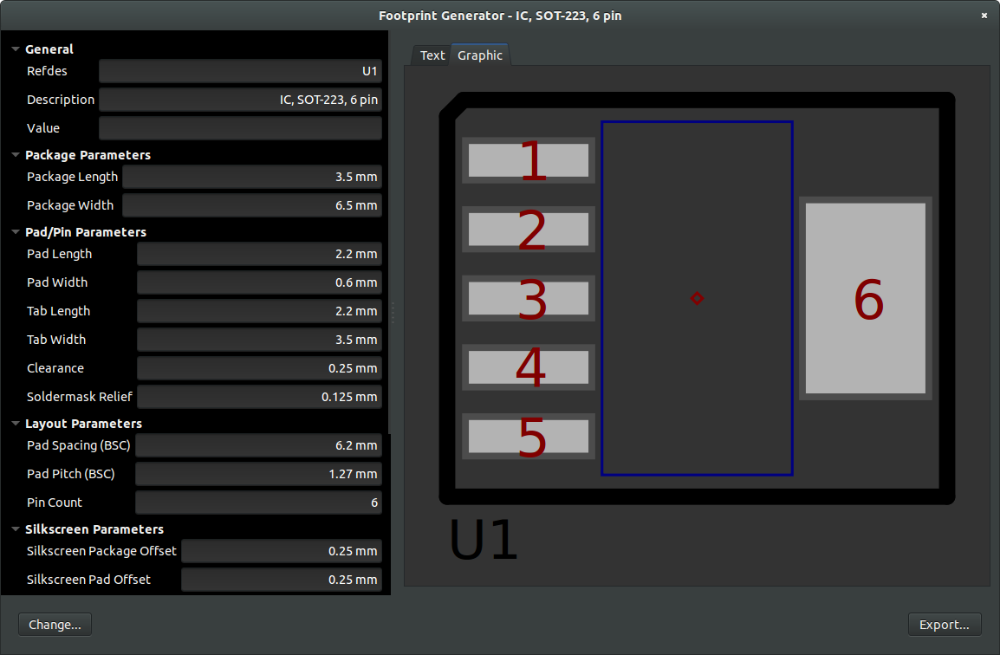

This project implements a footprint generator for
[PCB](http://pcb.geda-project.org/)
and
[pcb-rnd](http://repo.hu/projects/pcb-rnd/).
Files are output in the PCB file format. The generator currently
supports the following footprints:

|Chip|Generic 2 terminal SMT footprints|
|DIL|Dual-in-line SMT footprints|
|DIP|Dial-in-line through-hole footprints|
|DPAK|SMT footprints with pads on one side an a large tab on the other|
|Grid|Grid SMT footprints|
|Quad|Quad SMT footrpints|
|SIP|Single-in-line through-hole footprints|

The following figure shows a screenshot of the user interface.

